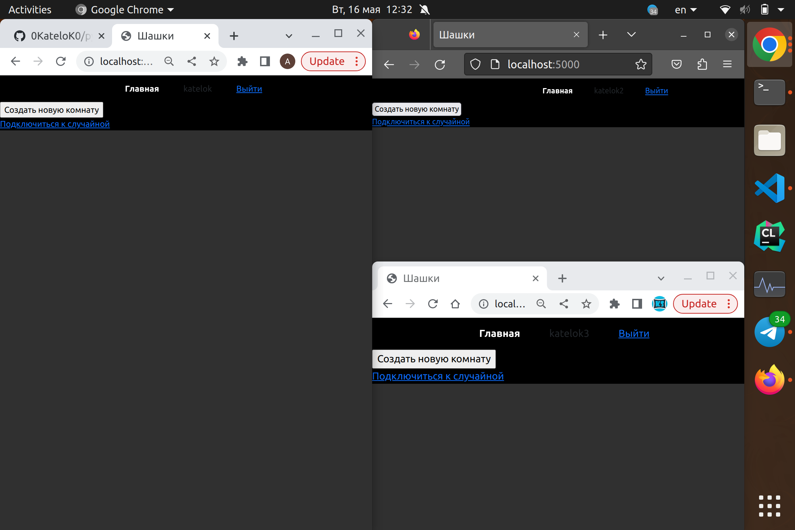
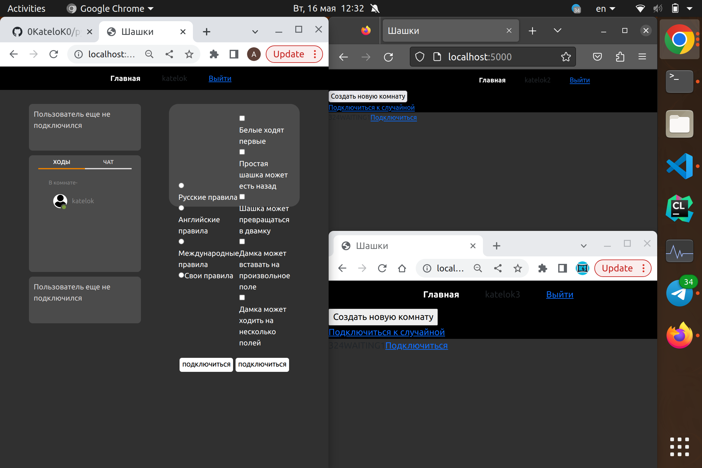
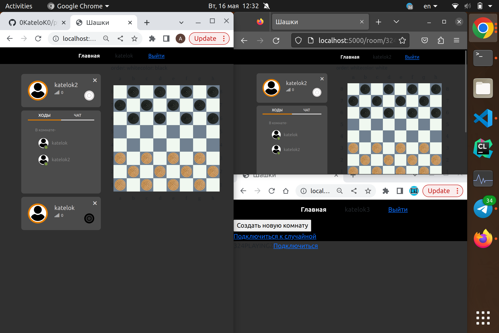
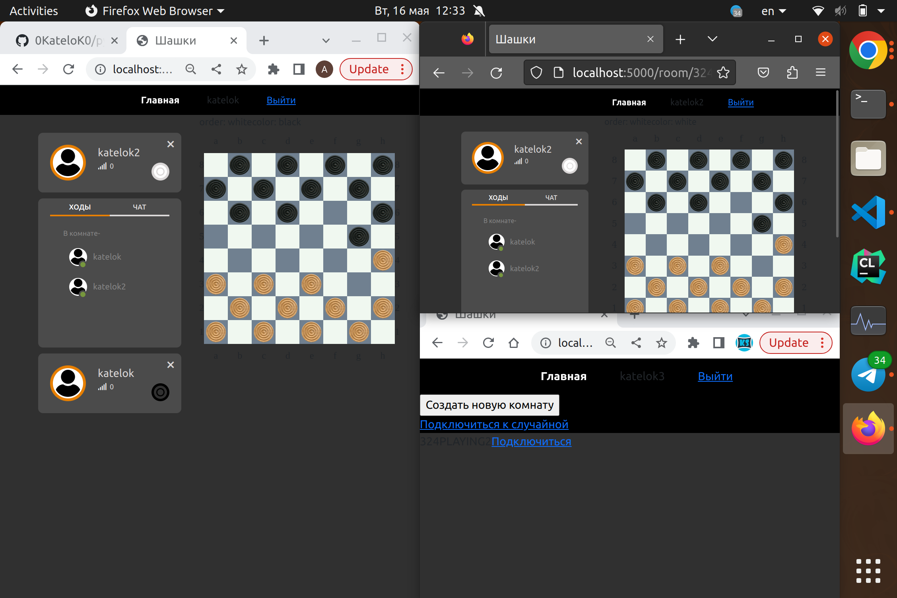
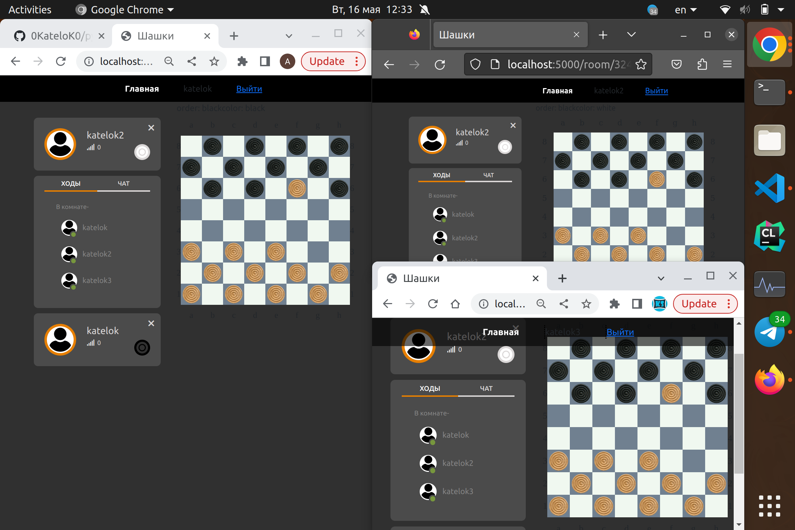
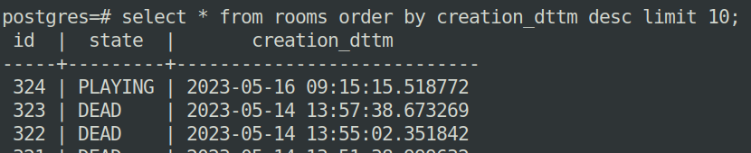
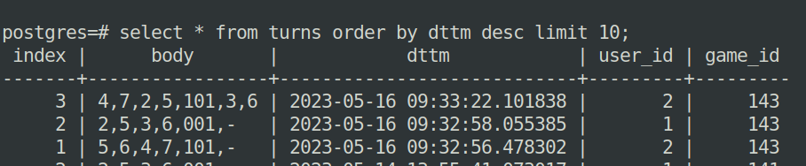

# Мультиплеерные шашки

Этот проект является серверным приложением, поддерживающим игру в шашки. Основными фичами проекта, кроме самой игры, является поддержка нескольких игр одновременно, возможность наблюдать за играми извне и сохранение всех результатов в базе данных. Пример взаимодействия:

Пустой сайт


Создал комнату


Начал игру


Сделал пару ходов


Подключил наблюдателя и сделал пару ходов


Пример работы с базой данных (можно сверить время создания с временем на скриншотах, в БД все хранится по GMT+0)

Создание комнаты

Запись ходов


## Запуск и установка

Для запуска потребуется докер, этой команды должно хватить

```bash
docker compose up
```
