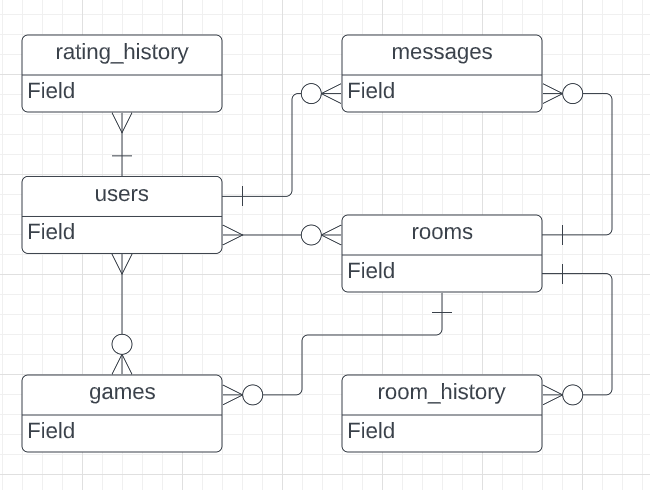
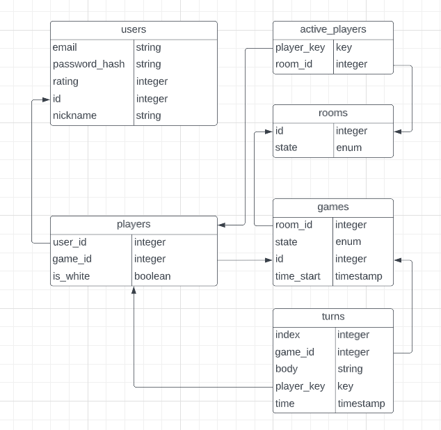

# Курсовой проект "Шашки онлайн"

Имеется база данных для сайта, позволяющего играть в шашки с другими людьми. В ней имеется информация о пользователях сайта и история игр. Пользователям необходимо будет предоставить возможность анализировать прошедшие игры как индивидуально, так и в купе.

Это мой личный проект, который, возможно, я в будущем буду расширять. Среди наиболее вероятных расширений имеется: задание аватара пользователя, игры с таймером, а также по другим правилам, внутриигровой чат. Эти факторы будут учитываться при проектировании базы данных.

Итого сущности в проекте будут таковы: пользователи(users), комнаты(rooms), игры(games), ходы в играх(turns), игроки(players).

База будет в 2НФ.

Примечания к физической модели:

В качестве ключа для пользователя не использована почта, потому что я хочу оставить возможность ее менять + это очень длинный ключ. Ник не использован, так как я не буду требовать уникальность от него, и его также можно будет менять.

Комнаты будут необходимы для восстановления состояния сайта в случае падения сервера.

Таблица active_players понадобилась из-за нормализации.

Все поля в таблице players суммарно определяют первичный ключ.

Возможные значения enum для games.state:
- PLAYING
- WHITE_WON
- BLACK_WON
- DRAW
- CANCELLED

Возможные значения enum для rooms.state:
- PLAYING
- WAITING
- DEAD

Ссылка на гугл док с физической моделью:
https://docs.google.com/spreadsheets/d/1hC_qekmgj2uTeukNfv29TqucTPXnWj-Y8AzS4u_D4f0/edit?usp=sharing

