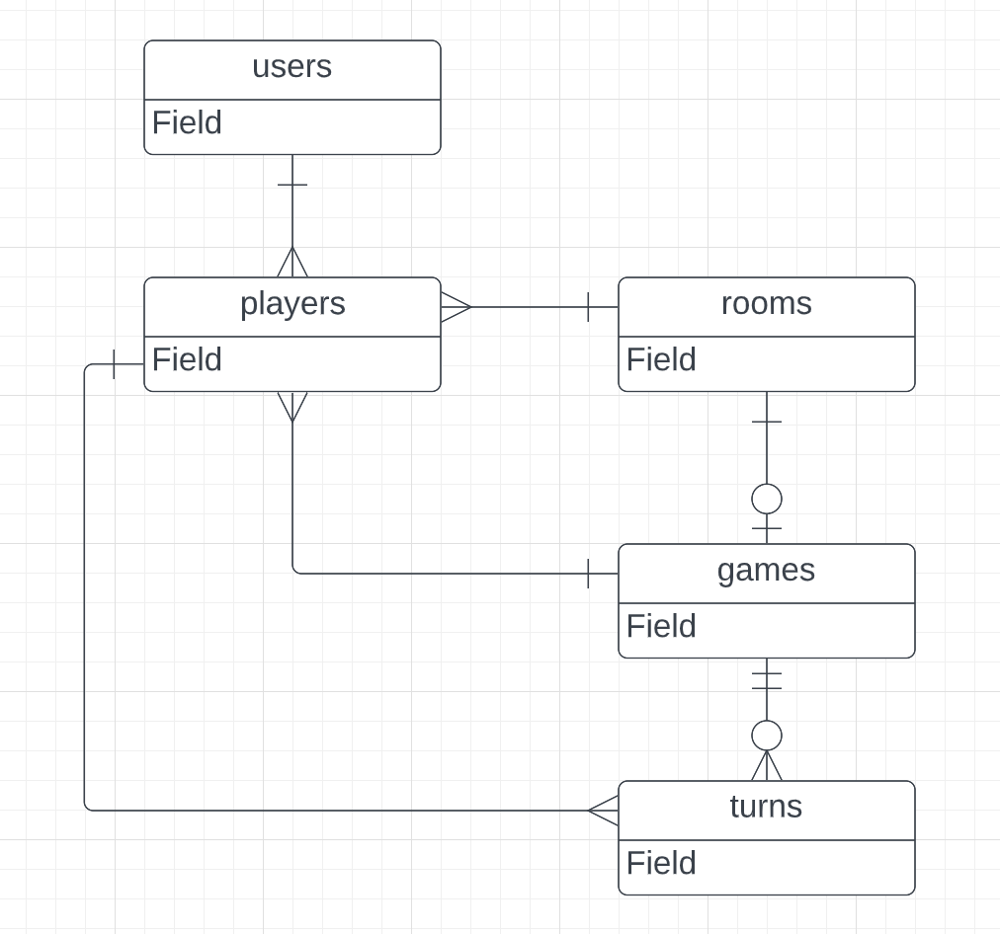

# Курсовой проект "Шашки онлайн"

Имеется база данных для сайта, позволяющего играть в шашки с другими людьми. В ней имеется информация о пользователях сайта и история игр. Пользователям необходимо будет предоставить возможность анализировать прошедшие игры как индивидуально, так и в купе.

Проект задумывается на долгосрочную перспективу, среди возможных расширений имеется: задание аватара пользователя, игры с таймером, а также по другим правилам, внутриигровой чат. Эти факторы будут учитываться при проектировании базы данных.

Итого сущности в проекте будут таковы: пользователи(users), комнаты(rooms), игры(games), ходы в играх(turns), игроки(players)

