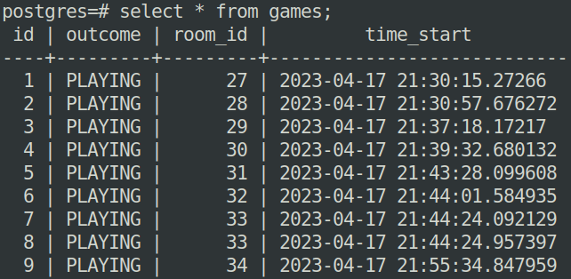

# Переработка записей в базе данных

Постановка проблемы:

Мой проект базы данных приурочен к разработке сервера для мультиплеерных шашек. Этот сервер разрабатывается постепенно, параллельно с запросами к базе данных. В связи с этим в базе данных образовалось большое количество некорректных / неполных записей. Данный файл направлен на борьбу с данной проблемой.

# Конкретные задачи:

1. Поскольку эта база данных рабочая, прежде чем начать, я создам транзакцию с savepoint в ее начале.
2. Почти у всех кортежей в отношении viewers неверно заполнено поле left_dttm. Точнее говоря, оно не заполнено вовсе. Простым фиксом будет назначить им всем одно время покидания - сейчас. Однако, хотелось бы, чтобы данные были корректны на протяжении всей базы, то есть, что пользователь не находится в нескольких комнатах одновременно. 
3. После исправления проблемы с фантомными пользователями, возникает аналогичная проблема с фантомными комнатами. Все комнаты, в которых в данный момент нет пользователей должны быть объявлены мертвыми. Однако, это не так. 
4. Теперь есть фантомные игры, которые "играются" в мертвых комнатах. Конечно, это, тоже надо исправить. 
5. В базе room_history также не хватает записей с изменениями истории комнаты. Эти записи необходимо добавить. 
6. В базе turns некорректно записаны записи о всех ходах, которые были сделаны. Во-первых у них некорректно записаны номера в пределах партии. Во-вторых ради оптимизации (и ради интереса), я хотел, чтобы у хода хранилось больше информации в специфичном формате. Это необходимо для легкого и быстрого восстановления игры по ее ходам. Если же не хранить ходы в новом виде, каждый раз при восстановлении игры по сути надо будет запускать функцию, которую я напишу для изменения. Далее при работе с бд я буду поддерживать корректные значения этих перменных. 

# Ура, база данных теперь в рабочем состоянии. Некоторые необходимые дополнения

7. Чтобы не быть голословным, что весь этот код работает, я решил скачать также все свои таблицы (до изменения), и перетащить их на gitlab. Их аж 9 штук и будучи уважающим себя программистом, я решил написать процедуру которая это сделает автоматически это за меня вместо того чтобы 9 раз написать COPY. 
8. Чтобы больше не пришлось заниматься подобными вещами, я решил написать триггеры для таблиц room->room_history и users->rating_history. Они будут добавлять записи в историю при изменении хранимых полей.
9. В процессе я случайно выяснил что у меня были недоставлены ограничения на все таблицы, использующие foreign key, что они должны быть NOT NULL. Да, из моей базы данных нельзя будет выпилиться(удалить аккаунт), вухахахахахах.

# Далее по заданию

10. Необходимо создать индексы в базе данных. Многие индексы для полей вида SERIAL INTEGER создались автоматически. Единственным разумным местом для индекса мне показалось поле email у пользователя, поскольку каждый раз при входе в аккаунт используется запрос вида SELECT * FROM users WHERE email='smth'.
11. По заданию требуются view. Я создам view, где, очевидно, скрывается пароль пользователя. Далее вьюшки будут на список всех игр пользователя 
12. Я еще переделал несколько названий полей, чисто ради единства.